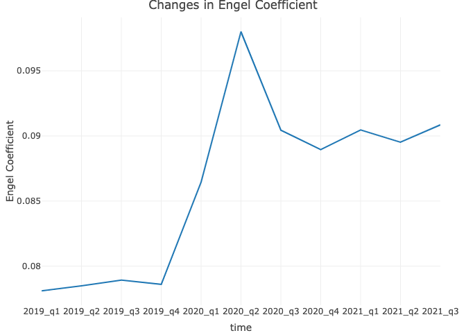
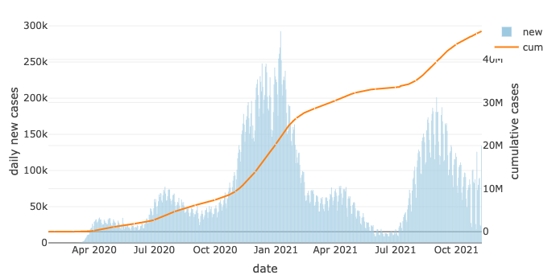

## Motivation

Ever since the spring of 2020, the COVID-19 pandemic has drastically altered the everyday lives of billions of people. Besides the way of living and working, the pandemic is slowly changing our way of consumption. 

As people were working from home and went out less due to restrictions on gatherings and social activities, we infer there might be a collapse in consumption mainly in the services sector, while consumption in indoor entertainment, household supplies etc. may increase as a result of the more time at home. We can get a brief sense of how our behaviors of consumption is changing from the changes in Engel Coefficient ever since the pandemic started. 

<center>

</center>

To further explore the changes of consumer behaviors caused by the pandemic, our group studied joint data collected from Bureau of Economic Analysis, and Center for Disease Control and Prevention.

&nbsp;

## Related Work

1."The decline and recovery of consumer spending in the US" Brookings, December 14, 2020  [link](https://www.brookings.edu/blog/future-development/2020/12/14/the-decline-and-recovery-of-consumer-spending-in-the-us/)\

2."A spring in consumers’ steps: Americans prepare to get back to their spending ways"Deloitte, June 28, 2021 [link](https://www2.deloitte.com/us/en/insights/economy/us-consumer-spending-after-covid.html)

&nbsp;

## Research Design

### Initial Question

Our project is designed to investigate how the Covid-19 pandemic has affected US people’s consuming behavior. We intend to research whether there are changes to people's total personal consumption expenditure(PCE) and their consumption pattern since the pandemic happened in March 2020. We are also interested in how much people’s consuming behaviors has recovered since the society is gradually returning to normal life in 2021. 

Initial Hypothesis: Covid 19 changes the value/structure of consumption expenditure.

### Evolution of Analytic Questions

• There is evidence that the severity of Covid-19 varies among states, so as the PCE. To address the differences, we analyzed the data by states by drawing maps based on Covid 19 and consumption expenditure data. 

• The pandemic has lasted for two years, thus using the data since the pandemic for modeling is insufficient and biased. To address this problem, we build a prediction model of PCE based on income and consumption data since 1967. To test the hypothesis, we predict the consumption data in 2020 and 2021 using the model and compare it to the real-world data.

• The inflation and recent rises in prices potentially affect the PCE data as well. To address this, we considered inflation and analyze using chained dollars. which is a method of adjusting real dollar amounts for inflation over time, allowing the comparison of figures from different years.

### New Questions Identified During Analysis

PCE is also affected by the trend of personal incomes, and government’s laws to support and sustain businesses and individuals through the pandemic. In addition, we examined how the pandemic has impacted personal incomes and savings in U.S., and whether they matched the changing of PCE. In this process, we can obtain more comprehensive understanding of how the pandemic has influenced people’s economic conditions and behaviors in different aspects.

&nbsp;

## Data

### Data Sources

<p>• Personal Consumption Expenditures by Major Type of Product and by Major Function:

https://www.bea.gov/data/consumer-spending/main

<p>• Personal Consumption Expenditures by Major Type of Product and by Major Function, by State:

https://apps.bea.gov/itable/iTable.cfm?ReqID=70&step=1

<p>• Trends in Number of COVID-19 Cases and Deaths in the US Reported to CDC: 

https://covid.cdc.gov/covid-data-tracker/#trends_dailycases

### Variables of Interest

**Consumption Expenditure**
<p>• `functions`: the different functions of the goods.
<p>• `time`: different quarters.
<p>• `consumption`: the total amount of consumptions.

**COVID Cumulative Cases**
<p>• `state`
<p>• `date`: the date when the data collected.
<p>• `total_cases`: the amount to the cases diagnosed within and before the date.
<p>• `case_rate`: the amount of cases since the pandemic started for every 100,000 people.

**COVID Daily Cases**
<p>• `state`
<p>• `date`: the date when the data collected.
<p>• `total_cases`: the amount to the cases diagnosed within the date.

**PCE by State**
<p>• `state`
<p>• `year`: the year of which the PCE by date was calculated.
<p>• `type`: major types of product.

**Personal Income and Savings**
<p>• `wages_and_salaries`: wages and salaries received from employers
<p>• `supplements_to_wages_and_salaries`: supplemental payments received from employers
<p>• `social_security`: benefits include old-age, survivors, and disability insurance benefits that are distributed from the federal old-age and survivors insurance trust fund and the disability insurance trust fund
<p>• `medicare`: benefits include hospital and supplementary medical insurance benefits that are distributed from the federal hospital insurance trust fund and the supplementary medical insurance trust fund
<p>• `personal_current_taxes`: total personal tax payment

### Data cleaning

<P>  From `Consumption Function`, we deleted unneeded rows (whose row numbers are greater than 28, since these rows are not showing the function of the goods), made a `time` variable that sorted the years and the quarter. We renamed `Household consumption expenditures (for services)` to `household`, and renamed `Final consumption expenditures of nonprofit institutions serving households (NPISHs)1` to `nonprofit consumption`, since the original names are too long. 

<P>  From `COVID Cumulative Cases`, we combined the new case data frame and the cumulative case data frame together and seperate the time points into `month`, `day` and `year`. Then we created a new variable named `date` that rewrite the date into the form of `YYYY-MM-DD`.

<P>  To compare the covid case data and the consumption data, we built a new data frame named `covid_seasonal` that reorder the covid case data by season (quarter 1 = January - March, quarter 2 = April - June, quarter 3 = July - September, quarter 4 = October - December). 

<P>  From `PCE by State`, we renamed some variables,deleted some unneeded columns and use `pivot_longer` to tidy the dataframe. We added a `code` variable for each state, in convenience of making interactive maps. Then we joined the total and per capita dataframe, calculated the percent change of PCE each year using `lag` function.

&nbsp;

## Exploratory Data Analysis

<p> The lowest value of consumption expenditure actually did not happen as expected at the peak of the pandemic but at the second quarter of 2020, when cases just start to rise. The expenditures of services experienced a steeper change than expenditures of goods due to the shutdown of businesses, the quarantine and the lock down policies etc.Even though cases keep rising, as restrictions keep lifting, the rate of vaccination keep rising, economics keep recovering, people's consumption expenditure grows steadly after the third quarter of 2020. Although the severity of Covid 19 reached to the first peak in the fourth quarter of 2020, it has limited effect on people's consumption behavior. The total consumption expenditure is even larger by now comparing with that before the pandemic. This can be partially explained by inflation and government’s stimulus plan.

<center>

</center>

### US Covid 19

<p> The dataset of Covid 19 in the United States begins from January 17, 2020. With cumulative number of postive cases keep rising, the first peak of new cases occurred in the summer of 2020, and the largest peak happened at the beginning of 2021.

<center>

</center>

If analyze based on states, California, Texas, and Floida has the greatest number of total positive cases. However, considering the population factor, states in central part of the US tend to have higher case rate (positive number of cases per 100k people), with North Dakota being the one with the highest rate. 

### Consumption Expenditure

<p> Durable goods are divided into four categories. Consumption in `Recreational goods and vehicles` and `furnishings and durable household equipment` did not experience significant drop in the second quarter of 2020 like the other two. Changes in working mode and more time spent at home resulted in people's growing demand for household equipment and in-door recreational equipments. 

Nondurable goods are divided into four categories. The proportion of consumption expenditure on food/beverages and other nondurable goods exceeds much than that of clothing/footware and energy goods all time. Even when Covid outbroke, unlike the changes in consumption of clothing/footware and energy goods, that in food/beverages and other nondurable goods is not experiencing reduction in the pandemic but increases steadly. 

```{r, echo=FALSE,out.width="50%", out.height="50%",fig.cap="PCE by function",fig.show='hold',fig.align='center'}
knitr::include_graphics(c("./images/eda_2.png","./images/eda_3.png"))
``` 

Expenditures in household services are divided into seven categories. Only the `housing and utilities`(which mainly includes housing rental and the fees for the resources at home such as electricity and gas) and `financial service and insurance` (which mainly includes life and health insurance and commissions in banks) were not reduced but even increased in the pandemic.
Expenditures of outdoor services like `Transportation`, `Food service and accomodation`, and `Recreation service` reduced significantly in the second quarter of 2020 
due to nationwide quarantine policies. The total consumption of transportation and recreation services hasn't recovered to the level before the pandemic by the third quarter of 2021. 

<center>

</center>

&nbsp;

#### PCE by State

State personal consumption expenditures (PCE) decreased 2.6 percent in 2020 after increasing 3.7 percent in 2019, according to statistics released today by the U.S. Bureau of Economic Analysis (BEA). The percent change in PCE across all 50 states and the District of Columbia ranged from 1.2 percent in Idaho and Utah to –5.8 percent in the District of Columbia. PCE increased in only four states, Idaho, Utah, Montana, and Arkansas.

```{r, message = FALSE, warning=FALSE, fig.width = 9}
library(tidyverse)
library(readxl)
library(plotly)

#load data for pce by states
raw_df = 
  read_excel("data/pce_by_state/pce_by_state.xlsx", sheet = "Table 1", range = "A4:F63", col_names = FALSE)

colnames(raw_df) = c("state", "pce_2018", "pce_2019", "pce_2020", "change_2019", "change_2020")

postal_code = 
  read_csv("./data/us_postal_code.csv") %>% 
  janitor::clean_names()

pce_state_df_1 = 
  raw_df %>% 
  filter(!(state %in% c("United States", "New England", "Mideast", "Great Lakes", "Plains", "Southeast", "Southwest", "Rocky Mountain", "Far West"))) %>% 
  mutate(
    text_2020 = paste(state, "\n", "PCE:", pce_2020),
    text_2019 = paste(state, "\n", "PCE:", pce_2019),
    text_change_2020 = paste(state, "\n", "Percent change:", change_2020),
    text_change_2019 = paste(state, "\n", "Percent change:", change_2019)
  )

pce_state_df_1 = left_join(pce_state_df_1, postal_code, by = "state")

personal_df = 
  read_excel("data/pce_by_state/pce_by_state.xlsx", sheet = "Table 4", range = "A4:G63", col_names = FALSE)

colnames(personal_df) = c("state", "personal_pce_2020", "housing", "health", "food", "gasoline", "other")

pce_state_df_1 = 
  left_join(pce_state_df_1, personal_df, by = "state") %>% 
  mutate(
    population = pce_2020 / personal_pce_2020,
    personal_pce_2019 = round(pce_2019 / population),
    text_personal_2020 = paste(state, "\n", "Personal PCE:", personal_pce_2020),
    text_personal_2019 = paste(state, "\n", "Personal PCE:", personal_pce_2019)
  )

# load data set of covid by states
read_data_function = function(file_df) {
  
  state_df = 
    read_csv(file_df, skip = 2)
  
  return(state_df)
}
# create a data frame containing all participants
state_2020 =
  tibble(
    files = list.files("./data/state_covid_separate")
  ) %>% 
  mutate(
    path = map(.x = files, ~paste("./data/state_covid_separate", ., sep = "/"))
  ) %>%                                                             # add path
  mutate(
    observations = map(path, read_data_function))

state_2020_tidy =
  state_2020 %>% 
  unnest(cols = "observations") %>% 
  janitor::clean_names() %>% 
  filter(date == "Dec 31 2020") %>%
  select(state, total_cases, total_case_rate_per_100k)

covid_state_df = left_join(state_2020_tidy, postal_code, by = "state") %>%
  drop_na()

#plotly percent change
g = list(
  scope = 'usa',
  projection = list(type = 'albers usa')
)

fig_1 = 
  plot_geo(pce_state_df_1, locationmode = 'USA-states') %>% 
  add_trace(
    type = "scattergeo",
    locations = ~code,
    text = ~code,
    mode = "text",
    textfont = list(color = rgb(0,0,0), size = 10),
    hoverinfo = "none"
  ) %>% 
  add_trace(
    z = ~change_2020, 
    locations = ~code,
    text = ~text_change_2020,
    color = ~change_2020, 
    colorscale = list(c(0, 0.85, 1), c("#c44934", "#ffffff", "#83c5fd")),
    hoverinfo = "text",
    colorbar = list(title = "PCE growth rates(%)", thickness = 20, x = 1, y = 0.8),
    visible = T
  ) %>% 
  add_trace(
    z = ~change_2019, 
    locations = ~code,
    text = ~text_change_2019,
    color = ~change_2019, 
    colorscale = list(c(0, 1), c("#f5faff", "#0863b0")),
    hoverinfo = "text",
    colorbar = list(title = "PCE growth rates(%)", thickness = 20, x = 1, y = 0.8),
    visible = F
  ) %>%
  layout(
    title = 'Personal Consumption Expenditures by State: Percent Change',
    geo = g,
    updatemenus = list(
      list(
        type = 'buttons',
        x = 0.1,
        y = 0.95,
        buttons = list(
          list(method = "restyle",
               args = list("visible", list(T, T, F)),
               label = '2019-2020'),
          
          list(method = "restyle",
               args = list("visible", list(T, F, T)),
               label = '2018-2019')
        )))
  )

fig_1
```

Generally, there is an apparent negative correlation between per capita PCE and Covid rates.

```{r, warning = FALSE}
# create joint data frame
jointly_df = 
  left_join(pce_state_df_1, covid_state_df, by = c("state", "code")) %>% 
  mutate(state = as.factor(state)) %>% 
  select(state, code, pce_2020, total_case_rate_per_100k, everything())

# make plot
Con_case_by_state =
jointly_df %>% 
  arrange(total_case_rate_per_100k) %>% 
  mutate(state = fct_reorder(state, total_case_rate_per_100k)) %>% 
  plot_ly(x = ~state) %>% 
  add_trace(y = ~personal_pce_2020, type = "scatter", mode = "lines",name = "PCE", yaixs = "y") %>% 
  add_trace(y = ~total_case_rate_per_100k, type = "bar", name = "Covid Cases(per 100k)", yaxis = "y2", opacity = 0.6, marker = list(color = 'rgb(158,202,225)'))  %>% 
  layout(title = list(text = "Per Capita PCE with Covid Cases, 2020", x = 0.13),
         xaxis = list(title = "State"),
         yaxis = list(title = "PCE", side = "left"),
         yaxis2 = list(title = "Covid Rate", side = "right", overlaying = "y"),
         showlegend = TRUE)

Con_case_by_state
```


## Regression Analysis

<p> Using the personal consumption expenditure (PCE) and income data, we aimed to investigate how the COVID-19 pandemic influence people's spending patterns. We know that one's consumption is associate with one's income, so we built a MLR model from income data and made predictions for PCE. Our variables of interest include `wages and salaries`, `supplements to wages and salaries`, `social security`, `medicare`, `personal current taxes`, and the outcome `PCE`.

<p> We hypothesized that the PCE pattern has changed with respect to income for pre- v.s. in-pandemic periods. To test this hypothesis, we fitted a MLR model using data from year 1967-2018, the "pre-pandemic" period. We then used this model to predict for PCE outcomes for a pre-pandemic year, 2019, and a in-pandemic year, 2020, respectively. Then we compared if there is significant difference in the root mean square errors (RMSE) between the pre-pandemic and in-pandemic periods. If there is significant difference between them, we can conclude that there is enough evidence showing that the PCE patterns has changed during the pandemic and vice versa. 

<p> Our model fits the data well because our $R^2$ value is $> 99\%$. We then used multiple diagnostic methods to evaluate the model. The QQ-plot indicates the distribution of residuals are normal. The Scale-location plot shows that the residuals are spread equally along the range of predictors. And the residuals-leverage plot shows that no outlier is influential. Therefore, we were confident to proceed our analysis with the MLR model. 

<p> Giving the MLR model and its predictions for PCE, we explored the difference in the root mean square errors (RMSE) of the model between the pre-pandemic and in-pandemic periods in dollars. To obtain a pool of RMSE data, we utilized bootstrapping method on data of year 2019 and 2020. The results were tested via the t-test, which indicated a significant difference between the RMSEs of the two years. This indicated that people's spending pattern has changed during the pandemic, and this change could not fully explain by variations of their incomes. 

<p> Therefore, there is evidence showing that the COVID-19 pandemic has affected people's spending patterns. 

&nbsp;

## Discussion

First, we performed a series of exploratory analyses on COVID-19 cases and expenditure data. We visualized the cases of COVID-19 in the U.S. from 2020 up to now. The bar plot reveals that the first peak of the positive cases in the U.S. occurred in April 2020, and it kept rising in the entire pandemic period. We then visualized the case number per state on a map plot, from which we found that California has the greatest number of positive cases, whereas North Dakota has the largest case rate. Our observation showed that some central states also have a relatively large case rate compared to other states.

To understand the consumption expenditure components, we then looked at the goods and services consumed at the beginning of and during the pandemic (from the year 2019 to 2021). We observed that the percentages of both durable and nondurable goods dropped significantly in the second quarter of 2020, but it bounced back to normal level afterward. It revealed a temporary influence of pandemic on consumption expenditure, although which effect seemed to dampen over several months. 

Afterward, to verify our hypothesis that the COVID-19 did affect the spending pattern, we proposed a model based on population income to predict the personal consumption expenditure (PCE). The model is built using pre-pandemic data since 1967 and tested on the year 2019 and 2020 to illustrate the difference in the predictions. We then performed statistical tests via bootstrapping samples and conclude that there is a significant difference between our model prediction of PCE for the year 2019 and the year 2020. This indicated that people’s spending patterns have changed during the pandemic, which cannot be fully explained by variations in their incomes. Therefore, there is evidence showing that the COVID-19 pandemic has affected people’s spending patterns.

Then we used `shiny` to analyze the PCE patterns by state and year. From the map we found that the cases per state were inversely proportional to the per state expenditure i.e., people tended to spend less among states where the pandemic was more severe. Overall, we concluded that the COVID-19 pandemic has a negative impact on people’s expenditure patterns in the U.S.

### Limitations

There are some limitations in our study: the personal consumption expenditure (PCE) data retrieved from BEA is on a quarterly basis, so we only have less than 30 observations after the covid outbreak. Thus, the dataset is not sufficient to model the consumption expenditure in the pandemic period. To address this problem, we built a regression model of consumption expenditure based on personal savings data from 1967 and test the significance of the changes between the predicted value in 2020 and the actual value. What’s more, since the data is given quarterly, some abnormal changes might be impossible to observe. As for PCE by state, we could only achieve data until 2020, so the analysis of reconciliation and prediction is limited.

### Future Implication

Based on analysis of consumption structure, we observed that the consumer behaviors are gradually returning to the level before the COVID. Even though life is getting back to normal, the new variant Omicron is now coming, and several related cases have been confirmed in the United States. The future is hard to predict, we are still uncertain what is waiting for us in the coming new year. There might be another significant wave of changes economic changes due to the new outbreak. Thus, the changing pattern we analyzed can be used as reference for residents and businesses to get better prepared for future changes.

&nbsp;

## Conclusions

Consumer spending is the key component of quarterly gross domestic product. Spending data for the nation and each state help businesses predict consumer behavior and make decisions about hiring and investing. These statistics also help policymakers and researchers understand the interplay between Americans’ incomes, spending, and saving. The expenditure pattern is presumably affected by domestic income, and other social or environmental factors. Our study explored the influence of the pandemic on expenditure to understand how public health factor affects spending behaviors.

Overall, the findings for the changes in consumption expenditure during the pandemic is consistent with what we had originally hypothesized. We expected there was changes in the value as well as the structure of the consumption of goods and services due to covid pandemic. More specifically, we found that consumption expenditures of services experienced a steeper change than expenditures of goods due to the shutdown of businesses, the quarantine, and the lock down policies etc.The regression model we built for consumption prediction demonstrated the significant difference of PEC for year 2019 and 2020 and confirmed the hypothesis that covid pandemic had affected people’s spending pattern.
